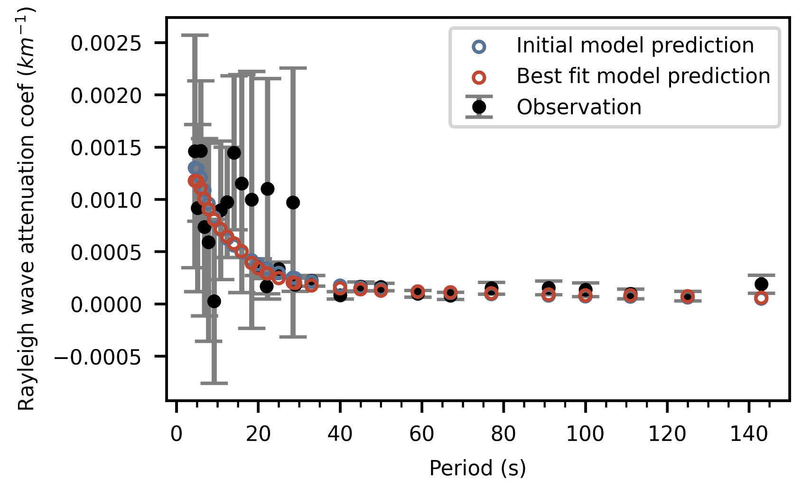

# 把张卓然的结果和我的拼接起来直接做反演

## 结果

1. 上图中误差棒大的为我的结果, 其余为zzr的测量结果. 反演设置 **varm=1.5**. 最终模型相比于初始模型正演结果没有太大提高.

2. 迭代过程几乎一步就收敛了

3. 结果来看, 10-20km深度有一个高衰减层. 50km左右低衰减. 150km左右高衰减. 直觉上符合Tibet的熔融分布.

4. rank=3.7

## 问题
1. 反演没有拟合上高频的数据
2. Q值结果没有展示出地壳的结构细节

## 准备进行的下一步工作
1. varm调大
2. 浅层分更多的层,深层分粗糙些 

## 导师
1. 结果差. 低频数据和高频数据没凑上, 这样反演误差太大了, 主要是长周期控制.
2. 周一讨论后再做