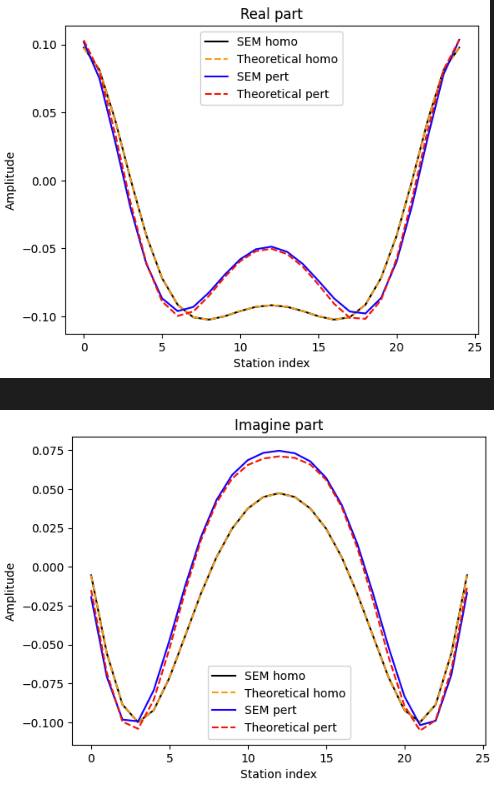
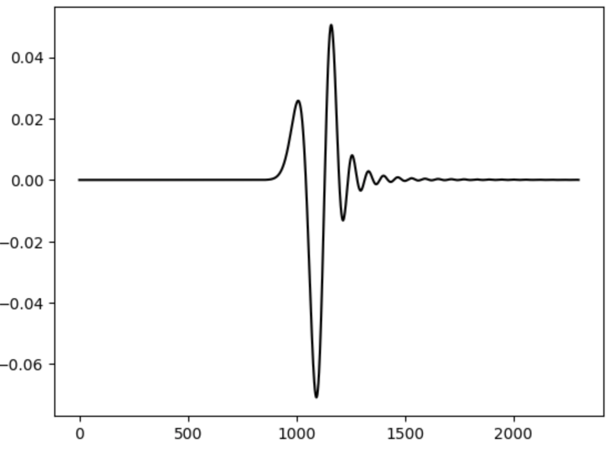
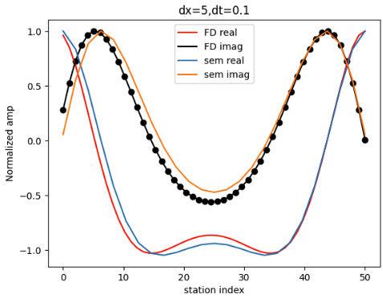
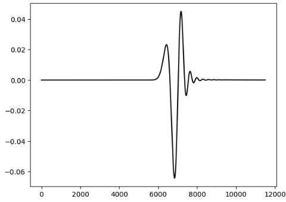
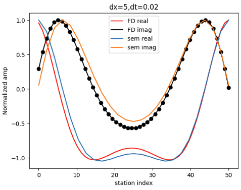
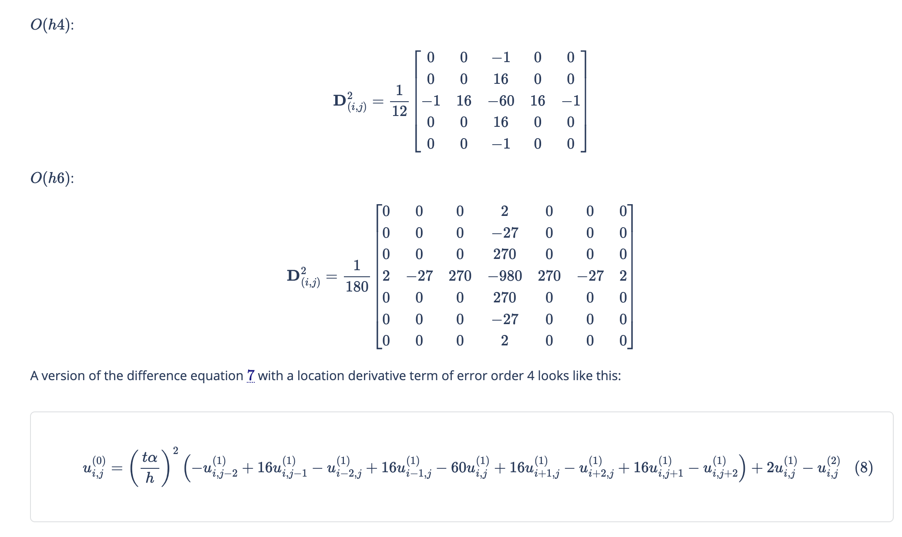
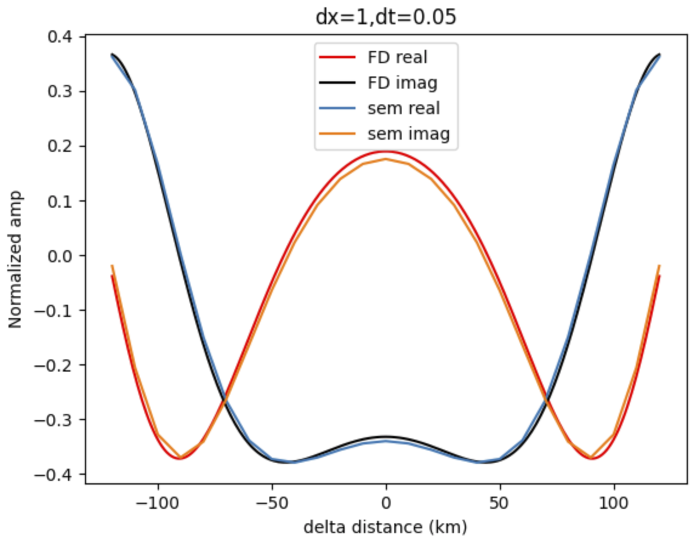

# 先测试了Tmatrix在弹性散射中的应用. 加上衰减的步骤还没走完

## 弹性
### sem模拟
用sem, ricker wave作为源模拟地震波, 用理论连续傅立叶变换公式提取频谱(注意不是和python fft一样的那种离散傅立叶变换).提取出来的频谱出了问题:
1. 结果为正确结果的共轭,还未排查出来
   1. 之所以判定不正确是算了相位. 随着震中距的增加, 到时会出现延迟, 相位也会延后, 但是我算出来相位是增加, 故而有问题
   2. 推测不是sac文件的什么性质导致的. 在FD2D中出现了和sem结果一样的现象.很有可能是我的什么地方理论出了问题, 比如不该用exp(-i omega t)的地方多了个负号等等
2. sem提供的震源时间函数乘了1e10, 我怀疑可能还有一定倍数的放缩. 因为Tmatrix方法算出来的频谱的绝对大小对不上,推测是source一项差一个系数

Update: 已确认就是该问题. 由于后面不再用到sem, 不需要浪费时间debug.

### T-matrix
顺利通过

## 衰减
由于不知道如何在specfem2d里按照自己的需求加上衰减系数. 故而寻求有限差分(FD2D)求解damping波动方程的方案. 但是在实际操作过程中, Tmatrix算出来的结果和FD2D有很大差别.

推测原因为FD2D有问题. Tmatrix方法暂不清楚. 需要先解决FD2D. 大体有三个方案:
- [ ] 在自己的原来代码上调整dx和dt, 看能否压制数值频散并且跑出和sem的homo条件下一致的频谱
   1. 因为之前测试的homo条件的频谱同时得到了sem和Tmatrix的证明, 可以判断为可靠的, 如果FD2D连这个都对不上, 那一定是FD2D的问题
- [ ] 用ch推荐的FD2D代码跑, 先跑通均一的, 然后再去查分格式里面加上衰减
- [ ] 直接去搜索sem求解Relativistic heat conduction的代码, 这个名词是green function里面提到的. 还可以通过gpt询问更多的关键词
   
## FD2D问题
### 低阶差分 dx=5 dt=0.1
数值频散严重

但是频谱能和sem映证

### 低阶差分 dx=5 dt=0.02
数值频散相比dt=0.1改善了一点

频谱拟合sem也没有变好

### 高阶差分 dx=5 dt=0.1
结果被覆盖了,就不重跑了. 用的是O(h6)的差分格式. 时域确实看不见数值频散了, 但是频率特征查得很远, 还不如低阶差分. [差分格式网址](https://beltoforion.de/en/recreational_mathematics/2d-wave-equation.php)

## TODO
- [ ] Fd和sem对比的时候有横向的“偏移” 可能是FD index台站选取的时候多/少了一两个

## Update
应该先尝试找SEM方法, 毕竟这个代码后期还要反复用于正演复杂模型. 如果这里能搞定, 后面会省事很多. 如果还是用的FD, 即使homo测试通过了, 后期可能还是会遇到很多麻烦.

改小了dx后数值频散降下来了,但是还是和sem对不上. 我怀疑:
- [ ] 比较的过程中坐标位置弄错了
  - [ ] 发现差一个index频谱差别巨大. 一个dx=2km时. 差2/3=0.667s 造成频谱完全对不上. 说明dx在频谱分析中很重要
- [ ] 基于上一点的第一小点, 我又怀疑可能是差分精度不够. 且问题主要是dx

dx 改成2km还是不行. 但是好转了一点点

改成dx=1 dt=0.05后基本成功了

这里的 SEM real和imag 是 “强行修正到和T-matrix结果一样”的版本. 即这里的FD计算结果和T-matrix均质下的相似.

这也解决了上文提到的“共轭”和“震源放大一个系数”的问题. BUG来自于当时SEM的处理. 但是这个BUG没有纠正的必要了. 我只需要知道T-matrix方法可靠(且我学会了)即可

## 下一步
- [ ] 写一个更高精度的有限差分, 必须保证这一步不出错, 否则T-matrix方法和它做比较的时候不能保证正确性
   1. 写出来后还是先画上面那个图, 通过了则进行含衰减的计算
   2. 由于FD不需要频繁使用. 所以算慢一点也可以.
      1. dx=1km的情况算了15min, 那么完全可以接受把它放慢8倍. 注意波场不要一直存在内存, 可以过一段输出一次, 清空

 - [ ]  dx=1 dt=0.05可能只是巧合. 时间切片可能没切对.time index 弄错. e iwt弄错了