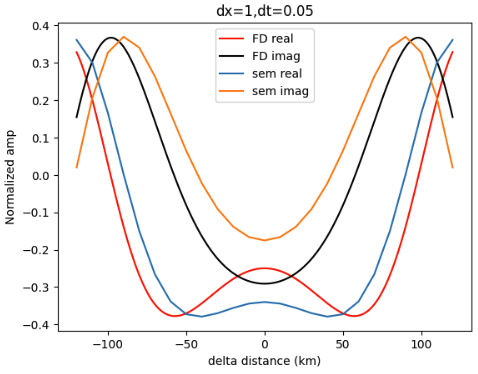
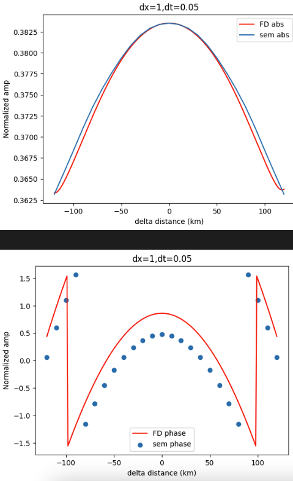
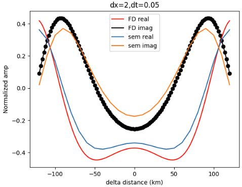
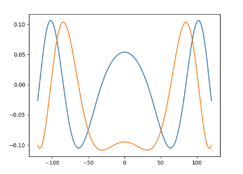

很遗憾, 昨天最后那张对得很好的图其实是碰巧算错了, 真实应该长这样:

它看起来如此抽象的原因:

其实振幅是对的. 主要有一个微小的到时差.

和dx=2的有轻微不同, 画图过程中两个FD都没有乘系数, 两个sem的绝对大小是一样的:

算了一个dx=0.5 dt=0.025的

结果更不乐观, 多出了wave. 

## 总结
1. 有限差分的精度可能达不到要求. 还是寻求sem求解热导方程的软件包吧