## FEM vs T-matrix 结论: Tmatrix能做衰减

## FEM
根据前面的经验,放弃了有限差分这条路,用FreeFEM软件完成有限元模拟.

### 通过均匀介质下的波场测试
首先测试了在均一介质下的模拟结果和理论值的差别, 发现有明显差异, 调整了以下参数未果:

* 网格划分的dx大小
* 网格划分的方式(方方正正的均匀网格 vs 空间上看起来比较歪歪扭扭的网格)
* dt的大小
* 狄拉克函数的近似方法(e/(x2+e2) vs 1/x)
* 狄拉克函数e/(x2+e2) 选取不同大小的e
* 震源时间函数乘以1e10, 做此操作是推测当时可能存在小数字的数值误差

最后发现影响的核心因素是基函数选取:参见[FreeFEM官网文档](https://doc.freefem.org/documentation/finite-element.html#list-of-the-types-of-finite-elements)

均一条件下的FEM和理论比较:
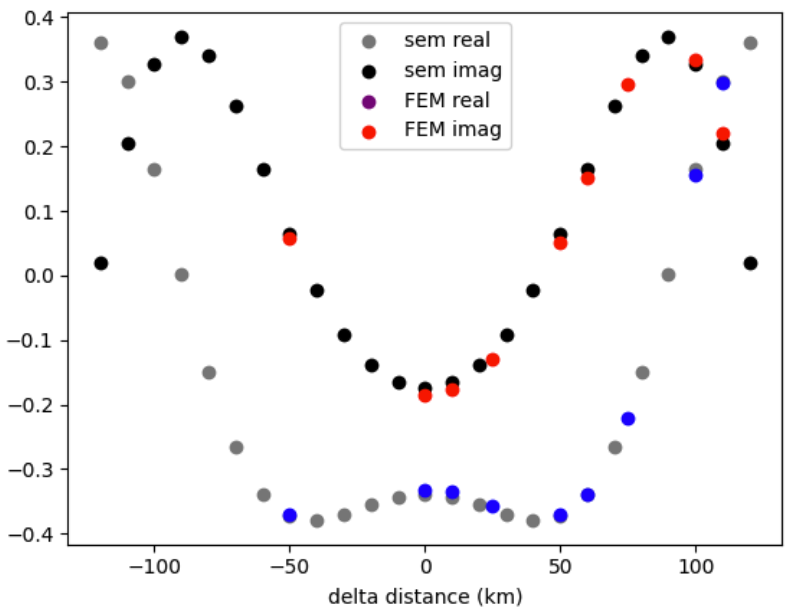
之所以能用SEM的作为参考, 是因为T-matrix实现过程中用了格林函数算理论值,二者完全一致,所以可以认为此处的sem结果是“正确答案”.

附上FEM参数:
* dx    =   4 km
* dt    =   0.1 s
* fm    =   0.06 hz
* c     =   3 km/s
* FreeFEM基函数    :   P2b

至此该软件的可靠性得到了证明.

## T-matrix  单区域测试
### FEM区域划分和参数设置
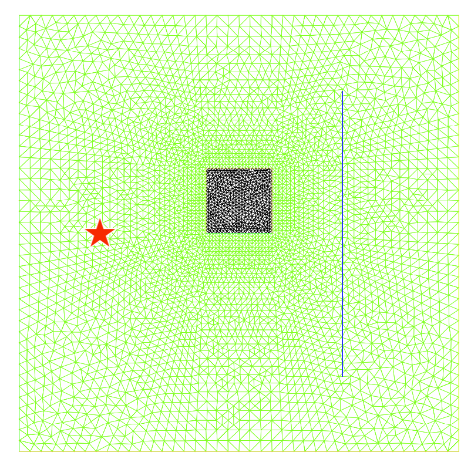
* fm=0.06hz, T=16.7s, 波长=50km
* alpha=0.006, c=3, 衰减系数为alpha/(2c)
* 源到测线的中心的距离120km, 源(0,0)点
* 测线长度240km
* 衰减区域边长60km, 正方形, 左下角(90,0)点

### FEM结果
1. 波形没有数值频散,通过时窗选取去除边界影响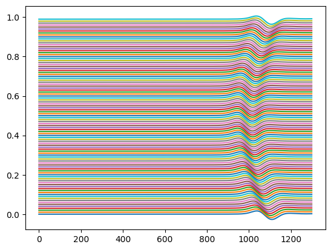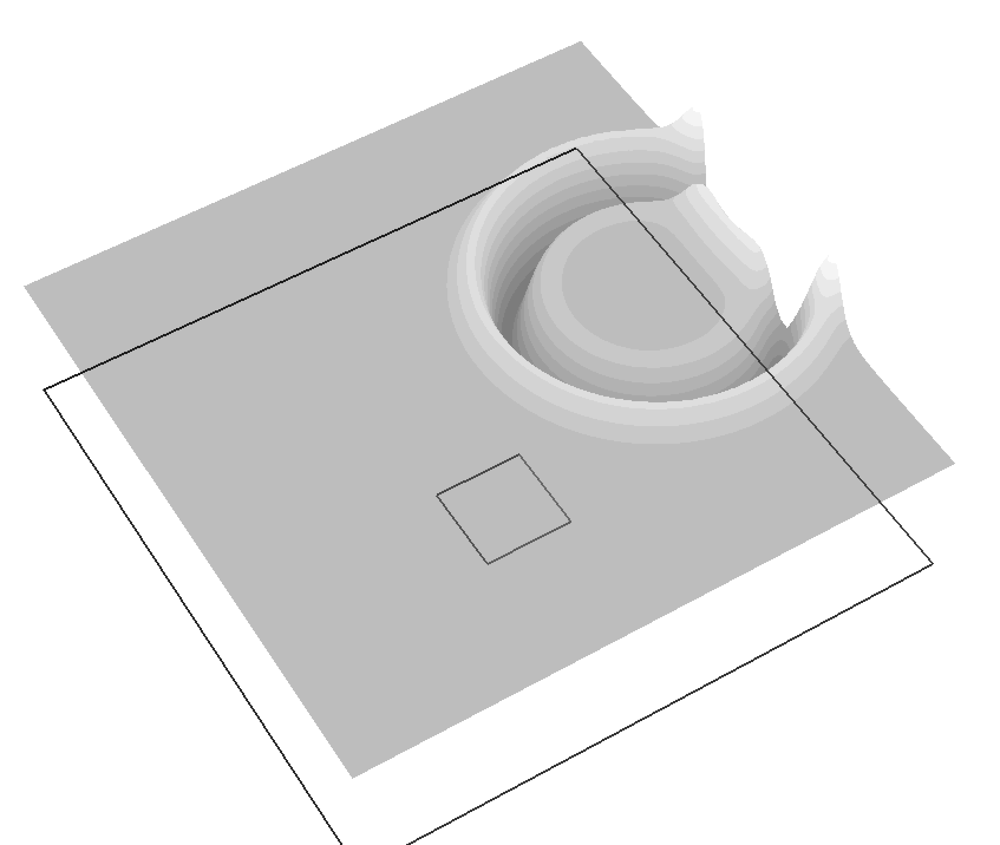
2. 频谱符合直觉,正半轴经过衰减的波的振幅看起来要低一点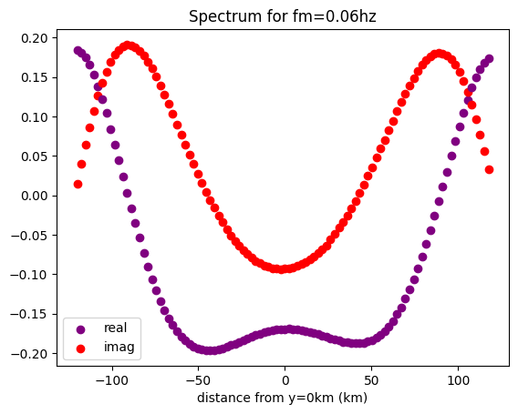
3. 对频谱求振幅谱看起来也是合理的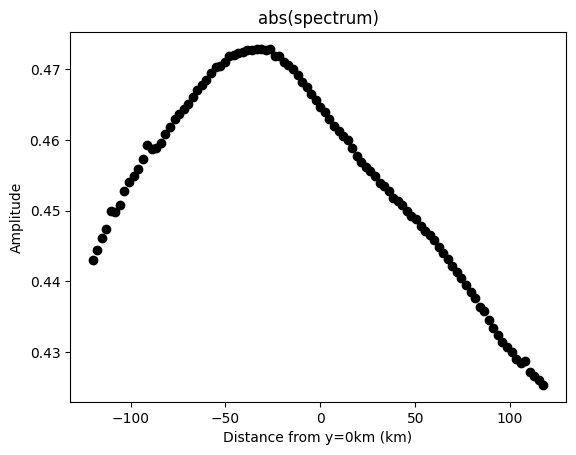
4. 直接用最大振幅看起来也具有和abs相似的特征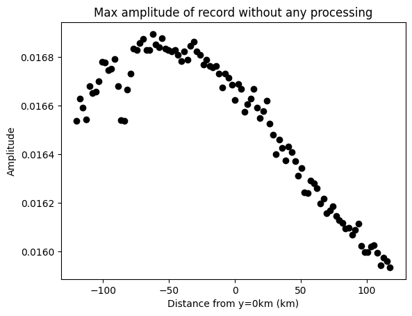
5. 对频谱求phase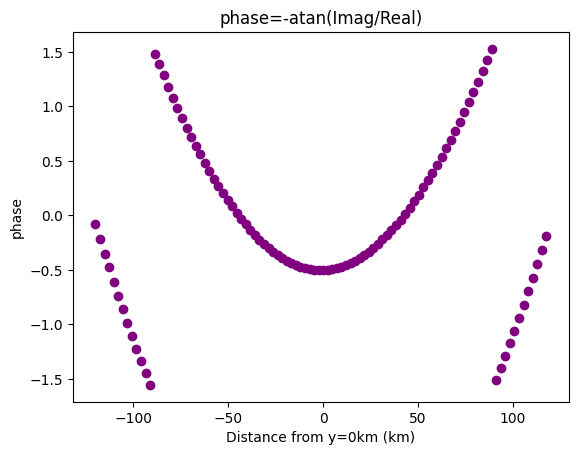

对phase进行说明, 更细节参见[网上FFT笔记](https://3326545509.github.io/note.github.io/?file=FFT%E6%8C%AF%E5%B9%85%E7%9B%B8%E4%BD%8D):

$$
f(t)=\int_0^{-\infty}c(\omega)cos(\omega t-\Phi(\omega))d\omega
$$

$$
\Phi(\omega)=arctan\frac{-I[F(\omega)]}{R[(\omega)]}
$$

$\Phi(\omega)$越大, 在时间域体现出来的到时应该越滞后, 相当于整个波都往时间增大的方向平移了. 那么如上图5中的phase则是合理的, 从x=0往两边走, 震中距都是增大,到时增加, 相位也随之增加.

总总迹象表明, FEM的模拟是合理的.那问题很可能在Tmatrix的实现过程中.

### T-matrix结果
实部和虚部经过**不正当处理**后能和FreeFEM结果对应上

**不正当调整**:
1. 结果取共轭
2. 结果颠倒顺序(实部和虚部都沿着y=0对称)或者改变dm的正负号, 二者均可达到相同的效果.

待求方程的时间域表达:
$$
u_{tt}+\alpha u_t - c^2 \Delta U=f
$$
转到频率域:
$$
-\omega^2U+i\omega\alpha U - c^2\Delta U=f
$$
即:
$$
(\frac{\omega^2}{c^2}  -\frac{i\omega\alpha}{c^2})U+\Delta U=-\frac{f}{c^2}
$$

原T-matrix方法的 $dm=1/c^2-1/c_0^2$ **我觉得**正确的dm应该是:

$$
dm = (\frac{1}{c^2}  -\frac{i\alpha}{c^2\omega}) - (\frac{1}{c_0^2}  - 0 )
$$
但是, 很遗憾, 这样算出来结果不对, 在本例$c=c_0$中, 要**强行调整**成
$$
dm = +\frac{i\alpha}{c^2\omega}
$$

**正当调整**
1. 对T-matrix和FEM结果的绝对大小进行了放缩, 因为FEM模拟出来的结果, 虽说输入的是f(x,t), 但是源差个倍数. 但是出现了一个**可能不正常**的现象:
   1. **这个倍数似乎是频率依赖的**, 我对0.06hz为主频的ricker考察f=0.06Hz时倍数为0.141, 0.1Hz时是0.164
   
## 为了知道上述的现象是否为巧合, 进行了第二次实验
### 模型
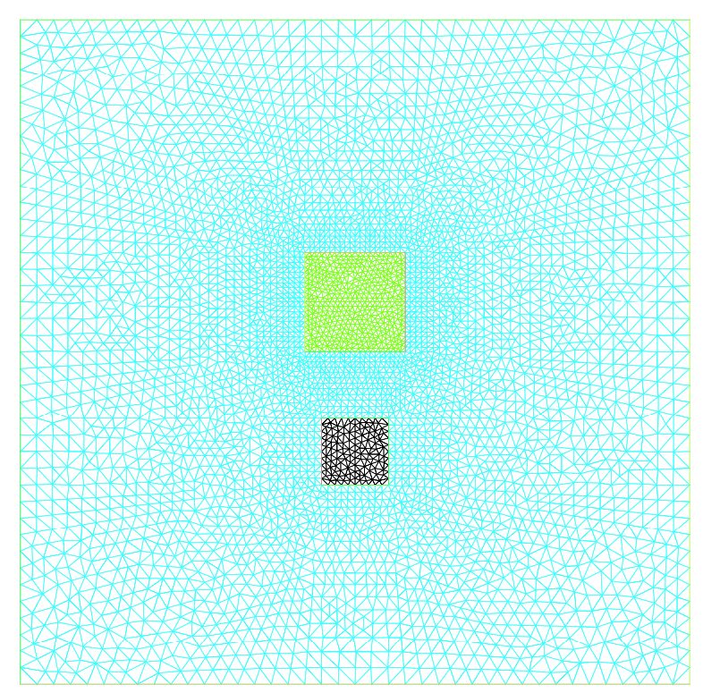
增加了一个alpha=0.01的更强衰减区域.

### T-matrix结果
相同的调整策略再次奏效了
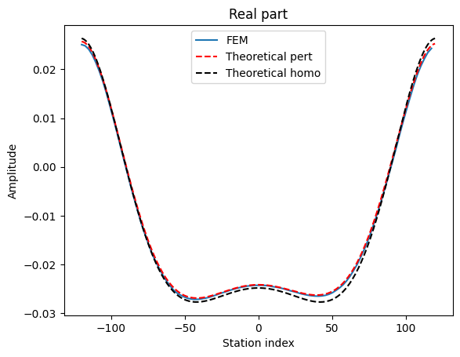
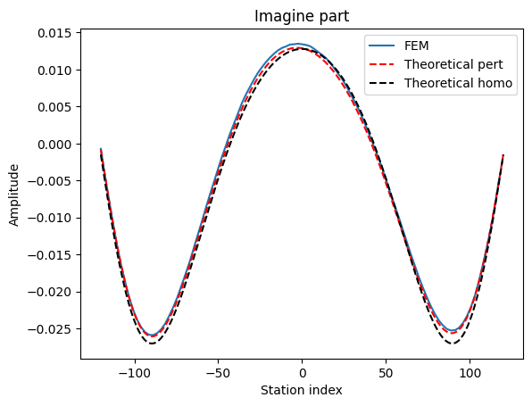

## 待解决问题
两个调整一定是“代码”,“理论”或者“测试”出现了问题, 需要找出来.