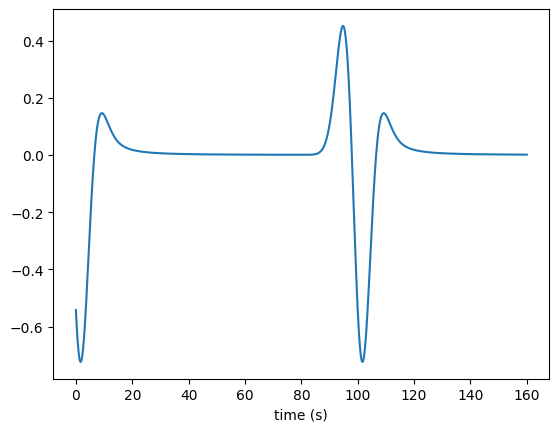

# 格林函数的问题

Helholtz equation 的格林函数有outgoing和incoming两种, 当时选错了. 

解决掉这个问题后, 再把dm改成我预期的那个, 两个bug都一起解决了. 

**至此Tmatrix的正演思路全部细节弄明白了.**

hankek1: [格林函数网站2](https://bingweb.binghamton.edu/~suzuki/Math-Physics/LN-16_2D_Green_function.pdf)

hankel2: [格林函数网站1](https://www.ee.iitm.ac.in/uday/2015a-EEL766/linesource.pdf)
## 频率域反傅立叶变换到时间域

波形看起来合理, 到时符合预期(震中距/速度+时间延迟)
