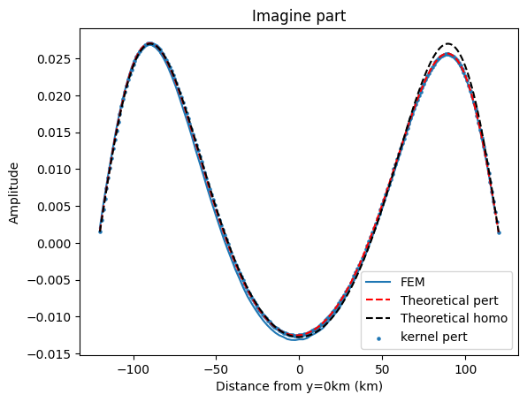

# 格林函数的问题和衰减系数的kernel

## 格林函数和衰减扰动的dm
Helholtz equation 的格林函数有outgoing和incoming两种, 当时选错了. 

* hankek1: [格林函数网站2](https://bingweb.binghamton.edu/~suzuki/Math-Physics/LN-16_2D_Green_function.pdf)

* hankel2: [格林函数网站1](https://www.ee.iitm.ac.in/uday/2015a-EEL766/linesource.pdf)

解决掉这个问题后, 再把dm改成我预期的那个, 两个bug都一起解决了.

**至此Tmatrix的正演思路全部细节还差一个“不知道是否可能随频率变化的乘在震源上的系数”.**

### 频率域反傅立叶变换到时间域

计算了若干频率的实部和虚步, 然后做反FFT到时间域, 波形看起来合理, 到时符合预期(震中距/速度+时间延迟)

## 衰减系数的kernel甚至适用于高衰减区域
在做Tmatrix的时候顺便写了一个kernel, 简单的实验表明精度很高. 符合预期.

模型沿用250226的第一个只有一个衰减区域的模型:

kernel算出来的结果和Tmatrix近乎一致(下图蓝点和红线)

把kernel的结果和Tmatrix做相对误差, 把分母趋于0时候的点去除

可以看到误差基本在1%量级. 而且本实验中用到的衰减区域较大, 衰减系数0.001(要用alpha/(2c)=0.006/(2*3)得到)

衰减系数kernel的优势:
1. 衰减效应不比弹性散射,天然较弱. 所以计算精度非常高
2. 衰减和弹性散射可以分割开来. 可以在已有的速度模型之上加衰减, 这个时候kernel依旧适用. 相当于可以用衰减来让不能迭代走下去的纯弹性反演走下去.
3. 不受到衰减区域的几何形状, 大小, 强度的影响.

## 球鸡